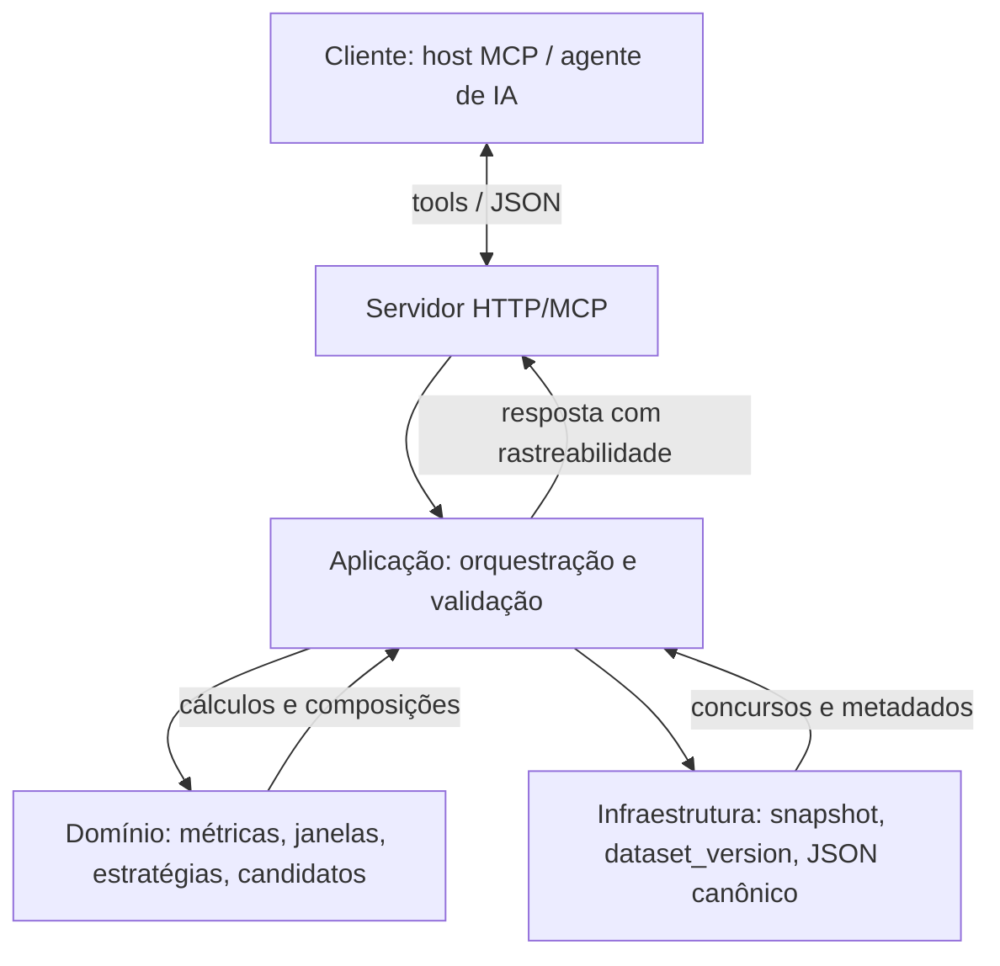

# Lotofacil-IA

Projeto para análise e políticas relacionadas à Lotofácil.

## Metodologia de desenvolvimento

Este repositório segue **spec-driven development**: a implementação não começa pelo código “livre”, mas pelos artefatos normativos em `docs/`.

Isso significa que:

- a **fonte de verdade semântica** está na documentação versionada;
- cada entrega nasce de um **recorte explícito do spec**;
- cada recorte precisa de **teste correspondente**;
- mudanças de semântica exigem atualização coordenada de **docs + testes + código**;
- o trabalho é executado em **fatias verticais pequenas**, começando pela V0;
- a implementação segue **TDD**, com foco em contrato, fórmula, determinismo e erros.

### Fluxo da aplicação (visão geral)

O serviço expõe ferramentas MCP/HTTP; o cliente (host ou agente) envia parâmetros alinhados ao contrato. O servidor delega a casos de uso, que combinam regras do domínio com dados versionados da infraestrutura e devolvem JSON explicável e rastreável. Métricas e agregações são determinísticas (mesmo input canônico ⇒ mesmo output canônico); já a geração de jogos candidatos pode ser **não replayável** quando a estratégia for estocástica e o request não declarar `seed` (replay é opt-in).



Em termos práticos, a ordem de trabalho é:

1. definir ou confirmar o spec aplicável;
2. escolher a próxima fatia;
3. escrever os testes do recorte;
4. implementar o mínimo necessário;
5. validar contrato e determinismo;
6. só então avançar para a próxima fatia.

Os documentos centrais dessa metodologia são:

- [docs/brief.md](docs/brief.md) — contexto e mapa da documentação
- [docs/adrs/0003-processo-desenvolvimento-bmad-vs-spec-driven.md](docs/adrs/0003-processo-desenvolvimento-bmad-vs-spec-driven.md) — spec-driven como padrão
- [docs/adrs/0004-estrutura-arquitetural-inicial-mcp-dotnet10.md](docs/adrs/0004-estrutura-arquitetural-inicial-mcp-dotnet10.md) — arquitetura inicial congelada
- [docs/vertical-slice.md](docs/vertical-slice.md) — primeira fatia obrigatória
- [docs/contract-test-plan.md](docs/contract-test-plan.md) — ordem inicial de execução
- [docs/spec-driven-execution-guide.md](docs/spec-driven-execution-guide.md) — passo a passo operacional
- [docs/fases-execucao-templates.md](docs/fases-execucao-templates.md) — pedidos atômicos por fase (inclui extensões após a numeração 0–20 do guia, ex. ADR 0006, ADR 0007, [ADR 0008](docs/adrs/0008-descoberta-superficie-mcp-e-mapeamento-legado-top10-v1.md))

## Como executar no host MCP (stdio)

Para clientes MCP desktop (ex.: Cursor), execute o servidor em modo `stdio`.

### Opção A — Rodando via `dotnet run` (dev)

```json
{
  "mcpServers": {
    "lotofacil-ia": {
      "command": "dotnet",
      "env": {
        "Dataset__DrawsSourceUri": "{workspace}/tests/fixtures/synthetic_min_window.json"
      },
      "args": [
        "run",
        "--project",
        "{workspace}/src/LotofacilMcp.Server/LotofacilMcp.Server.csproj",
        "--",
        "--mcp-stdio"
      ]
    }
  }
}
```

Nesse modo o host MCP consegue descobrir e invocar as tools atualmente entregues no recorte V1 (`get_draw_window`, `compute_window_metrics` e `analyze_indicator_stability`) com a mesma semântica JSON usada nos POSTs HTTP `/tools/*`.

### Opção B — Rodando um executável publicado (`dotnet publish`)

Após publicar, você pode apontar o host diretamente para o executável gerado (Windows):

- exemplo de publish (pasta local):

```bash
dotnet publish "{workspace}/src/LotofacilMcp.Server/LotofacilMcp.Server.csproj" -c Release -o "{workspace}/artifacts/publish"
```

- exemplo de configuração MCP usando o executável:

```json
{
  "mcpServers": {
    "lotofacil-ia": {
      "command": "{workspace}/artifacts/publish/LotofacilMcp.Server.exe",
      "env": {
        "Dataset__DrawsSourceUri": "{workspace}/tests/fixtures/synthetic_min_window.json"
      },
      "args": ["--mcp-stdio"]
    }
  }
}
```

### Opção C — Rodando via ZIP (sem código fonte)

Esta opção é o modo **produto**: o usuário instala um ZIP contendo o executável do servidor e configura o host MCP (Cursor) para iniciar esse executável em modo `stdio`.

Decisão normativa: [ADR 0024](docs/adrs/0024-distribuicao-zip-mcp-stdio-http-sem-codigo-fonte-v1.md).

#### Conteúdo esperado do ZIP (Windows)

- `LotofacilMcp.Server.exe` (self-contained)
- (opcional) `README.txt` com o quickstart

#### Modo CLI mínimo e comportamento default (sem ambiguidade)

- **Modo CLI mínimo (produto ZIP, Cursor/hosts MCP)**: executar com **`--mcp-stdio`**.
- **Comportamento padrão (sem flags)**: o executável inicia em **modo HTTP**, expondo **MCP HTTP real** em `/mcp` e endpoints REST espelhados em `/tools/*` (ver [ADR 0005](docs/adrs/0005-transporte-mcp-e-superficie-tools-v1.md)).

#### Configuração do Cursor (exemplo `mcpServers`)

1) Extraia o ZIP para uma pasta fixa, por exemplo `C:\LotofacilIA\`.

2) Configure o host MCP para executar o binário extraído.

Exemplo:

```json
{
  "mcpServers": {
    "lotofacil-ia": {
      "command": "C:\\LotofacilIA\\LotofacilMcp.Server.exe",
      "env": {
        "Dataset__DrawsSourceUri": "file:///C:/dados/lotofacil/draws.json"
      },
      "args": ["--mcp-stdio"]
    }
  }
}
```

Notas importantes:

- `Dataset__DrawsSourceUri` é **obrigatória** e **não existe fallback/fixtures** (ver [ADR 0022](docs/adrs/0022-fonte-de-dados-e-metadados-de-ganhadores-v1.md)). Sem ela, tools que dependem do histórico devem retornar `DATASET_UNAVAILABLE`.
- **Discovery operacional** não depende de descritores externos. A fonte de verdade é o **protocolo MCP**:
  - `tools/list` (o host usa isso para listar tools),
  - tool `help` (onboarding/índice; ver [ADR 0009](docs/adrs/0009-help-e-catalogo-de-templates-resources-v1.md)),
  - tool `discover_capabilities` (discovery técnico por build; ver [ADR 0011](docs/adrs/0011-tool-de-discovery-de-capacidades-por-build-v1.md)).

#### Execução manual (STDIO) sem host (Windows)

Para depurar localmente sem um host MCP, rode o binário em STDIO e forneça o dataset por env var.

`cmd.exe`:

```bat
set Dataset__DrawsSourceUri=file:///C:/dados/lotofacil/draws.json
C:\LotofacilIA\LotofacilMcp.Server.exe --mcp-stdio
```

PowerShell:

```powershell
$env:Dataset__DrawsSourceUri = "file:///C:/dados/lotofacil/draws.json"
& "C:\LotofacilIA\LotofacilMcp.Server.exe" --mcp-stdio
```

### Auditoria da superfície MCP STDIO (métricas expostas)

Para auditar a **allowlist real** de métricas expostas por `compute_window_metrics` nesta build (via `discover_capabilities`) e validar invariantes simples por janela (ex.: tamanho/shape/somas), veja o runner `tools/McpMetricAudit` documentado em:

- [docs/spec-driven-execution-guide.md](docs/spec-driven-execution-guide.md#ferramenta-auxiliar-opcional--auditoria-mcp-stdio-de-métricas-expostas-e-invariantes-runner)

### Getting started (agnóstico ao host)

Para onboarding e discovery, a instância MCP expõe:

- a tool `help` (índice curto de templates + markdown do índice)
- o resource `lotofacil-ia://help/getting-started@1.0.0` (guia curto “por onde começo / quais opções”)
- o índice de templates em `lotofacil-ia://prompts/index@1.0.0`

## Dataset: `Dataset:DrawsSourceUri` (local ou URL)

O servidor lê o histórico de concursos a partir da configuração **`Dataset:DrawsSourceUri`** (ver [ADR 0022](docs/adrs/0022-fonte-de-dados-e-metadados-de-ganhadores-v1.md)). Em .NET, você pode configurar via variável de ambiente **`Dataset__DrawsSourceUri`**. Se ela estiver ausente/inválida, tools que dependem do histórico devem retornar `DATASET_UNAVAILABLE`.

Regras importantes:

- **Obrigatório (sem fallback):** se `Dataset__DrawsSourceUri` não for fornecida, o servidor não deve “adivinhar” uma fixture default.
- **`file://` suportado:** você pode passar um caminho local via URI `file://` (além de paths diretos).

### CSV (estilo CEF)

- **Separador**: `,` ou `;` ou tab (`\t`)
- **Header**: opcional (se existir, pode ser o header CEF)
- **Header CEF aceito**:
  - `Concurso`, `Data Sorteio`, `Bola1`..`Bola15`, `Ganhadores 15 acertos`
- **Sem header (posicional)**: 18 colunas nesta ordem:
  - `contest_id`, `draw_date`, `b1..b15`, `winners_15`

### JSON (canônico)

Arquivo com objeto e lista `draws`:

```json
{
  "draws": [
    {
      "contest_id": 1001,
      "draw_date": "2024-01-01",
      "numbers": [1,2,3,6,7,8,11,12,13,16,17,18,21,22,23],
      "winners_15": 0,
      "has_winner_15": false
    }
  ]
}
```

Regras:

- `winners_15` é obrigatório e `has_winner_15` deve ser coerente com `winners_15 > 0` (quando presente).

## Como executar no host MCP (HTTP)

### Endpoint MCP HTTP mínimo (normativo)

- **Endpoint MCP HTTP mínimo (v1)**: **`/mcp`**
- **O que ele é**: **MCP HTTP real (protocolo MCP)** em transporte *streamable HTTP* (ver [ADR 0005](docs/adrs/0005-transporte-mcp-e-superficie-tools-v1.md) e [ADR 0025](docs/adrs/0025-deploy-http-docker-iis-cloud-para-mcp-http-v1.md)).
- **O que ele NÃO é**: rotas HTTP REST que “espelham” o JSON do contrato (isso é compatibilidade/depuração e **não** implementa `tools/list` / `tools/call` do MCP).

Em outras palavras: o host MCP deve apontar para **`http://<host>:<porta>/mcp`** (e não para `/tools/*`).

### Como iniciar o servidor em modo HTTP

Para clientes MCP que conectam por URL, execute o servidor web normalmente (sem `--mcp-stdio`) e aponte para o endpoint MCP streamable (`/mcp`).

1) Inicie o servidor definindo `Dataset__DrawsSourceUri` no ambiente do processo.

Exemplo (bash):

```bash
export Dataset__DrawsSourceUri="{workspace}/tests/fixtures/synthetic_min_window.json"
dotnet run --project "{workspace}/src/LotofacilMcp.Server/LotofacilMcp.Server.csproj"
```

2) Configure o host MCP para conectar por URL:

```json
{
  "mcpServers": {
    "lotofacil-ia-http": {
      "url": "http://localhost:5000/mcp"
    }
  }
}
```

Observações importantes (sem ambiguidade):

- **`/mcp`** é o endpoint **MCP HTTP real** (protocolo: `tools/list`, `tools/call`).
- **`/tools/*`** são rotas **REST espelhadas (compatibilidade/depuração)**, não MCP (ver ADR 0005).
- **`/mcp/tools/*`** (quando existir) continua sendo **REST espelhado com prefixo confuso** e não deve ser descrito como “MCP/HTTP” (ver ADR 0005).
- **`Dataset__DrawsSourceUri` é obrigatória** e **não existe fallback/fixtures**: sem ela, tools que dependem do histórico devem retornar `DATASET_UNAVAILABLE` (ver [ADR 0022](docs/adrs/0022-fonte-de-dados-e-metadados-de-ganhadores-v1.md)).

### Execução do binário (ZIP) em modo HTTP (sem flags)

Quando você executa o binário **sem flags**, ele inicia em **modo HTTP** (com MCP HTTP real em `/mcp`).

- Para controlar a URL/porta de bind no Windows, use a variável padrão do ASP.NET Core:
  - `ASPNETCORE_URLS` (ex.: `http://127.0.0.1:5000`)

Exemplo (PowerShell):

```powershell
$env:Dataset__DrawsSourceUri = "file:///C:/dados/lotofacil/draws.json"
$env:ASPNETCORE_URLS = "http://127.0.0.1:5000"
& "C:\LotofacilIA\LotofacilMcp.Server.exe"
```

### Execução via Docker (HTTP)

O repositório inclui um `Dockerfile` para publicar a mesma aplicação ASP.NET Core em **modo HTTP**. Isso cobre o caso de **MCP HTTP real por URL**, conforme [ADR 0025](docs/adrs/0025-deploy-http-docker-iis-cloud-para-mcp-http-v1.md).

#### 1) Build da imagem

Na raiz do repositório:

```bash
docker build -t lotofacil-ia-http .
```

#### 2) Suba o container com dataset explícito

Exemplo usando a fixture do repositório montada como volume somente leitura:

```bash
docker run --rm \
  -p 5000:8080 \
  -e ASPNETCORE_URLS=http://+:8080 \
  -e Dataset__DrawsSourceUri=file:///data/synthetic_min_window.json \
  -v "$(pwd)/tests/fixtures:/data:ro" \
  lotofacil-ia-http
```

Nesse exemplo:

- o container escuta em `http://+:8080`;
- a porta `5000` da máquina host é mapeada para a porta `8080` do container;
- o dataset é lido do path **dentro do container** (`file:///data/synthetic_min_window.json`), não do path original da máquina host.

Se preferir usar dataset remoto, continue informando a variável obrigatória e troque apenas o valor:

```bash
docker run --rm \
  -p 5000:8080 \
  -e ASPNETCORE_URLS=http://+:8080 \
  -e Dataset__DrawsSourceUri=https://exemplo.com/lotofacil.json \
  lotofacil-ia-http
```

#### 3) URL do endpoint MCP HTTP

Com o mapeamento acima, o endpoint MCP real fica em:

- `http://localhost:5000/mcp`

Regra de composição da URL:

- host/porta externos: definidos por `docker run -p <porta-host>:8080`
- path MCP obrigatório: `/mcp`
- exemplo: `-p 8088:8080` resulta em `http://localhost:8088/mcp`

#### Variáveis de ambiente relevantes

- `Dataset__DrawsSourceUri` (**obrigatória**): fonte do dataset, conforme [ADR 0022](docs/adrs/0022-fonte-de-dados-e-metadados-de-ganhadores-v1.md). Sem essa variável, não existe fallback para fixture interna e tools dependentes do histórico devem retornar `DATASET_UNAVAILABLE`.
- `ASPNETCORE_URLS` (recomendada no container): URL de bind do servidor HTTP. O `Dockerfile` define `http://+:8080` como valor padrão para expor a aplicação dentro do container.

Regras importantes:

- Esta opção cobre **MCP HTTP** (por URL). Para **MCP STDIO no Cursor**, o caminho principal continua sendo a distribuição por ZIP (Opção C) — o Cursor normalmente executa um comando local.
- O endpoint MCP real continua sendo **`/mcp`**. As rotas `/tools/*` seguem como espelho REST/diagnóstico e não substituem o protocolo MCP.

### Deploy HTTP via IIS (reverse proxy)

O recorte mínimo de IIS da [ADR 0025](docs/adrs/0025-deploy-http-docker-iis-cloud-para-mcp-http-v1.md) é hospedar a mesma aplicação ASP.NET Core atrás do IIS, preservando **MCP HTTP real** no endpoint **`/mcp`** (e não convertendo a integração em REST espelhado).

#### 1) Publicar a aplicação ASP.NET Core

Em uma máquina com SDK .NET instalado, gere a pasta publicada:

```bash
dotnet publish src/LotofacilMcp.Server/LotofacilMcp.Server.csproj -c Release -o out/iis
```

O diretório publicado é o conteúdo a ser copiado para o servidor Windows/IIS.

#### 2) Pré-requisitos no Windows Server

- Instalar o **ASP.NET Core Hosting Bundle** compatível com a versão do runtime usado pela aplicação.
- Garantir que o IIS atue como **reverse proxy** para o processo ASP.NET Core publicado.
- Configurar a variável obrigatória **`Dataset__DrawsSourceUri`** no ambiente do processo/site. Sem ela, tools dependentes do histórico devem continuar retornando `DATASET_UNAVAILABLE`; não existe fallback para fixture interna.

#### 3) Criar o site/aplicação no IIS

- Apontar o site (ou application) para a pasta publicada em `out/iis`.
- Usar **Application Pool** com **`No Managed Code`**.
- Manter a configuração padrão do ASP.NET Core Module gerada no publish para encaminhar as requisições ao processo ASP.NET Core.
- Não criar regra de rewrite que troque **`/mcp`** por **`/tools/*`**. O path **`/mcp`** precisa permanecer o endpoint MCP HTTP real exposto ao host.

#### 4) URL que o host MCP deve usar

Quando o site estiver publicado na raiz do host, a URL MCP é:

- `https://<host-publico>/mcp`

Se a aplicação for montada sob um caminho-base no IIS, a URL externa vira:

- `https://<host-publico>/<base-path>/mcp`

Regra importante: o segmento final **`/mcp`** continua sendo o endpoint MCP real; **`/tools/*`** continua sendo apenas REST espelhado para compatibilidade/diagnóstico, conforme [ADR 0005](docs/adrs/0005-transporte-mcp-e-superficie-tools-v1.md).

#### 5) Verificação mínima de compatibilidade MCP

O aceite operacional do deploy IIS deve confirmar exatamente o que a ADR 0025 pede para um host MCP:

1. o host consegue conectar na URL MCP publicada (`.../mcp`);
2. `tools/list` funciona nessa conexão;
3. `tools/call` funciona nessa mesma conexão para pelo menos uma tool em escopo.

No repositório, a evidência automatizada que trava esse comportamento do endpoint MCP HTTP é a suíte `tests/LotofacilMcp.ContractTests/McpTransportParityIntegrationTests.cs`, que valida `tools/list` e `tools/call` em **MCP HTTP `/mcp`** com paridade semântica contra o HTTP REST espelhado.

Comandos úteis de verificação antes do deploy:

```bash
dotnet test tests/LotofacilMcp.ContractTests/LotofacilMcp.ContractTests.csproj --filter McpTransportParityIntegrationTests
```

Checklist rápido pós-publicação no IIS:

- a URL configurada no host MCP termina em **`/mcp`**;
- a conexão MCP abre sem apontar para `/tools/*`;
- `tools/list` retorna o catálogo esperado;
- `tools/call` responde com o payload MCP esperado para uma tool em escopo.

## Distribuição (ZIP) — visão geral

Para uso sem código fonte (Cursor/hosts MCP), a distribuição recomendada é um ZIP com executável self-contained (por plataforma), conforme [ADR 0024](docs/adrs/0024-distribuicao-zip-mcp-stdio-http-sem-codigo-fonte-v1.md).

## Integração real com OpenAI (live)

Para a esteira dedicada de integração real com OpenAI (tool calling), use:

- contrato e critérios: [docs/live-openai-integration-pipeline.md](docs/live-openai-integration-pipeline.md)
- prompts de referência (inclui cenário L6): [docs/prompt-catalog.md](docs/prompt-catalog.md)
- contrato MCP validado na resposta do servidor: [docs/mcp-tool-contract.md](docs/mcp-tool-contract.md)
- workflow dedicado: [`.github/workflows/live-openai-integration.yml`](.github/workflows/live-openai-integration.yml)
- teste de integração live (L6 estendido): [`tests/LotofacilMcp.ContractTests/LiveOpenAiIntegrationPipelineTests.cs`](tests/LotofacilMcp.ContractTests/LiveOpenAiIntegrationPipelineTests.cs)

### Execução local (L6 estendido opcional)

Defina ambiente com custo controlado e rode apenas o cenário L6:

```bash
export OPENAI_API_KEY="..."
export OPENAI_MODEL="gpt-4o-mini"
export OPENAI_MAX_ROUNDS="6"
export LIVE_OPENAI_ENABLE_L6="true"
dotnet test "tests/LotofacilMcp.ContractTests/LotofacilMcp.ContractTests.csproj" --configuration Release --filter "Category=LiveOpenAI&Scenario=L6"
```

### Execução no GitHub Actions

- Abra o workflow [`.github/workflows/live-openai-integration.yml`](.github/workflows/live-openai-integration.yml) na aba Actions.
- Execute via `workflow_dispatch`.
- Para incluir o cenário L6, marque `run_l6_extended=true`.
- O L6 roda como extensão `non-blocking` até promoção a bloqueador; o gate mínimo permanece L1–L5.

## Estrutura

| Caminho | Descrição |
|---------|-----------|
| [docs/brief.md](docs/brief.md) | Brief e escopo do projeto (índice da documentação em `docs/`) |
| [docs/metric-catalog.md](docs/metric-catalog.md) | Catálogo de métricas |
| [docs/vertical-slice.md](docs/vertical-slice.md) | Fatia vertical mínima e critérios de aceite |
| [docs/contract-test-plan.md](docs/contract-test-plan.md) | Plano de testes de contrato e fixtures douradas |
| `src/LotofacilMcp.Domain/` | Núcleo semântico: métricas, estratégias, janelas, erros e normalização |
| `src/LotofacilMcp.Application/` | Casos de uso, validação cross-field e orquestração |
| `src/LotofacilMcp.Infrastructure/` | Providers, dataset versioning, canonical JSON e observabilidade |
| `src/LotofacilMcp.Server/` | Servidor HTTP/MCP, tools, DI e toggles operacionais |
| `tests/fixtures/` | Dados e fixtures de teste (convênio em [contract-test-plan.md](docs/contract-test-plan.md)) |
| [`.github/workflows/live-openai-integration.yml`](.github/workflows/live-openai-integration.yml) | Workflow dedicado para suíte `LiveOpenAI` com L6 opcional |
| [`tests/LotofacilMcp.ContractTests/LiveOpenAiIntegrationPipelineTests.cs`](tests/LotofacilMcp.ContractTests/LiveOpenAiIntegrationPipelineTests.cs) | Teste de integração real OpenAI (cenário L6 estendido, não bloqueador) |

## Documentação

O ponto de entrada da pasta **`docs/`** é o [**brief**](docs/brief.md): escopo, restrições e links para os demais artefatos. Em qualquer outro `.md` dessa pasta há navegação de volta ao brief e ao README.

| Documento | Conteúdo |
|-----------|------------|
| [brief.md](docs/brief.md) | Contexto, escopo e mapa da documentação |
| [metric-catalog.md](docs/metric-catalog.md) | Métricas (tipagem e fórmulas) |
| [metric-glossary.md](docs/metric-glossary.md) | Glossário pedagógico das métricas |
| [mcp-tool-contract.md](docs/mcp-tool-contract.md) | Contrato das ferramentas MCP |
| [generation-strategies.md](docs/generation-strategies.md) | Estratégias de geração |
| [project-guide.md](docs/project-guide.md) | Estrutura e convenções do projeto |
| [spec-driven-execution-guide.md](docs/spec-driven-execution-guide.md) | Guia prático de execução spec-driven |
| [vertical-slice.md](docs/vertical-slice.md) | Fatia vertical mínima (V0) |
| [contract-test-plan.md](docs/contract-test-plan.md) | Plano de testes de contrato |
| [test-plan.md](docs/test-plan.md) | Plano de testes do domínio |
| [live-openai-integration-pipeline.md](docs/live-openai-integration-pipeline.md) | Integração real com ChatGPT (OpenAI), suíte L1–L5 e workflow manual no GitHub |
| [prompt-catalog.md](docs/prompt-catalog.md) | Catálogo de prompts para testes |
| [0001-fechamento-semantico-e-determinismo-v1.md](docs/adrs/0001-fechamento-semantico-e-determinismo-v1.md) | ADR: fechamento semântico e determinismo (v1) |
| [0002-composicao-analitica-e-filtros-estruturais-v1.md](docs/adrs/0002-composicao-analitica-e-filtros-estruturais-v1.md) | ADR: composição analítica e filtros estruturais (v1) |
| [0003-processo-desenvolvimento-bmad-vs-spec-driven.md](docs/adrs/0003-processo-desenvolvimento-bmad-vs-spec-driven.md) | ADR: processo de desenvolvimento (BMAD vs spec-driven) |
| [0004-estrutura-arquitetural-inicial-mcp-dotnet10.md](docs/adrs/0004-estrutura-arquitetural-inicial-mcp-dotnet10.md) | ADR: estrutura arquitetural inicial (MCP, .NET 10) |

Para implementação incremental, use [vertical-slice.md](docs/vertical-slice.md) e [contract-test-plan.md](docs/contract-test-plan.md). A V0/V1 inicial assume servidor HTTP único, sem IA embarcada no servidor, e com autenticação/throttling mantidos como capacidade contratual reservada que pode permanecer desligada por configuração.
