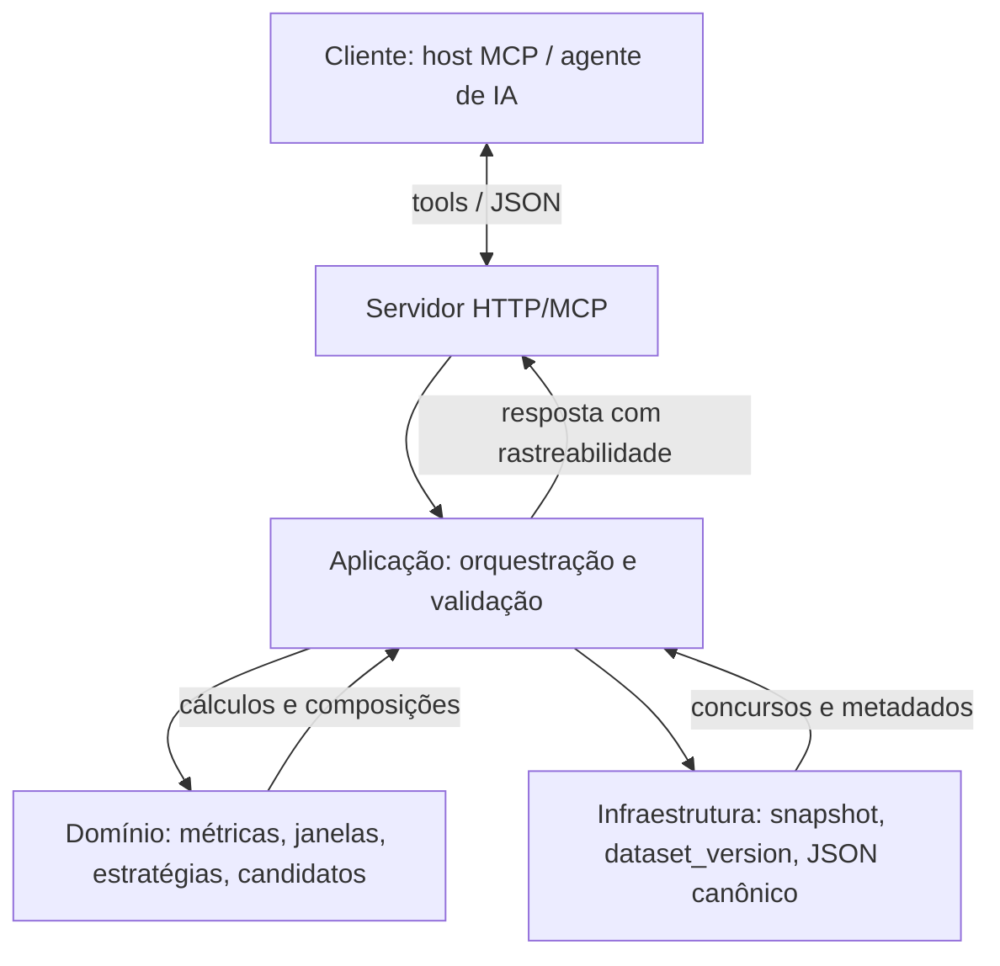

# Lotofacil-IA

Projeto para análise e políticas relacionadas à Lotofácil.

## Metodologia de desenvolvimento

Este repositório segue **spec-driven development**: a implementação não começa pelo código “livre”, mas pelos artefatos normativos em `docs/`.

Isso significa que:

- a **fonte de verdade semântica** está na documentação versionada;
- cada entrega nasce de um **recorte explícito do spec**;
- cada recorte precisa de **teste correspondente**;
- mudanças de semântica exigem atualização coordenada de **docs + testes + código**;
- o trabalho é executado em **fatias verticais pequenas**, começando pela V0;
- a implementação segue **TDD**, com foco em contrato, fórmula, determinismo e erros.

### Fluxo da aplicação (visão geral)

O serviço expõe ferramentas MCP/HTTP; o cliente (host ou agente) envia parâmetros alinhados ao contrato. O servidor delega a casos de uso, que combinam regras do domínio com dados versionados da infraestrutura e devolvem JSON determinístico e explicável.



Em termos práticos, a ordem de trabalho é:

1. definir ou confirmar o spec aplicável;
2. escolher a próxima fatia;
3. escrever os testes do recorte;
4. implementar o mínimo necessário;
5. validar contrato e determinismo;
6. só então avançar para a próxima fatia.

Os documentos centrais dessa metodologia são:

- [docs/brief.md](docs/brief.md) — contexto e mapa da documentação
- [docs/adrs/0003-processo-desenvolvimento-bmad-vs-spec-driven.md](docs/adrs/0003-processo-desenvolvimento-bmad-vs-spec-driven.md) — spec-driven como padrão
- [docs/adrs/0004-estrutura-arquitetural-inicial-mcp-dotnet10.md](docs/adrs/0004-estrutura-arquitetural-inicial-mcp-dotnet10.md) — arquitetura inicial congelada
- [docs/vertical-slice.md](docs/vertical-slice.md) — primeira fatia obrigatória
- [docs/contract-test-plan.md](docs/contract-test-plan.md) — ordem inicial de execução
- [docs/spec-driven-execution-guide.md](docs/spec-driven-execution-guide.md) — passo a passo operacional
- [docs/fases-execucao-templates.md](docs/fases-execucao-templates.md) — pedidos atômicos por fase (inclui extensões após a numeração 0–20 do guia, ex. ADR 0006, ADR 0007, [ADR 0008](docs/adrs/0008-descoberta-superficie-mcp-e-mapeamento-legado-top10-v1.md))

## Como executar no host MCP (stdio)

Para clientes MCP desktop (ex.: Cursor), use o mesmo executável `LotofacilMcp.Server` em modo `stdio`:

```json
{
  "mcpServers": {
    "lotofacil-ia": {
      "command": "dotnet",
      "args": [
        "run",
        "--project",
        "C:/_projeto/Lotofacil-IA/src/LotofacilMcp.Server/LotofacilMcp.Server.csproj",
        "--",
        "--mcp-stdio"
      ]
    }
  }
}
```

Nesse modo o host MCP consegue descobrir e invocar as tools atualmente entregues no recorte V1 (`get_draw_window`, `compute_window_metrics` e `analyze_indicator_stability`) com a mesma semântica JSON usada nos POSTs HTTP `/tools/*`.

### Getting started (agnóstico ao host)

Para onboarding e discovery, a instância MCP expõe:

- a tool `help` (índice curto de templates + markdown do índice)
- o resource `lotofacil-ia://help/getting-started@1.0.0` (guia curto “por onde começo / quais opções”)
- o índice de templates em `lotofacil-ia://prompts/index@1.0.0`

## Como executar no host MCP (HTTP)

Para clientes MCP que conectam por URL, execute o servidor web normalmente e aponte para o endpoint MCP streamable:

```json
{
  "mcpServers": {
    "lotofacil-ia-http": {
      "url": "http://localhost:5000/mcp"
    }
  }
}
```

Observação: `/mcp` é o endpoint MCP real (protocolo). Já `/tools/*` e `/mcp/tools/*` continuam sendo rotas REST de compatibilidade.

## Integração real com OpenAI (live)

Para a esteira dedicada de integração real com OpenAI (tool calling), use:

- contrato e critérios: [docs/live-openai-integration-pipeline.md](docs/live-openai-integration-pipeline.md)
- prompts de referência (inclui cenário L6): [docs/prompt-catalog.md](docs/prompt-catalog.md)
- contrato MCP validado na resposta do servidor: [docs/mcp-tool-contract.md](docs/mcp-tool-contract.md)
- workflow dedicado: [`.github/workflows/live-openai-integration.yml`](.github/workflows/live-openai-integration.yml)
- teste de integração live (L6 estendido): [`tests/LotofacilMcp.ContractTests/LiveOpenAiIntegrationPipelineTests.cs`](tests/LotofacilMcp.ContractTests/LiveOpenAiIntegrationPipelineTests.cs)

### Execução local (L6 estendido opcional)

Defina ambiente com custo controlado e rode apenas o cenário L6:

```bash
export OPENAI_API_KEY="..."
export OPENAI_MODEL="gpt-4o-mini"
export OPENAI_MAX_ROUNDS="6"
export LIVE_OPENAI_ENABLE_L6="true"
dotnet test "tests/LotofacilMcp.ContractTests/LotofacilMcp.ContractTests.csproj" --configuration Release --filter "Category=LiveOpenAI&Scenario=L6"
```

### Execução no GitHub Actions

- Abra o workflow [`.github/workflows/live-openai-integration.yml`](.github/workflows/live-openai-integration.yml) na aba Actions.
- Execute via `workflow_dispatch`.
- Para incluir o cenário L6, marque `run_l6_extended=true`.
- O L6 roda como extensão `non-blocking` até promoção a bloqueador; o gate mínimo permanece L1–L5.

## Estrutura

| Caminho | Descrição |
|---------|-----------|
| [docs/brief.md](docs/brief.md) | Brief e escopo do projeto (índice da documentação em `docs/`) |
| [docs/metric-catalog.md](docs/metric-catalog.md) | Catálogo de métricas |
| [docs/vertical-slice.md](docs/vertical-slice.md) | Fatia vertical mínima e critérios de aceite |
| [docs/contract-test-plan.md](docs/contract-test-plan.md) | Plano de testes de contrato e fixtures douradas |
| `src/LotofacilMcp.Domain/` | Núcleo semântico: métricas, estratégias, janelas, erros e normalização |
| `src/LotofacilMcp.Application/` | Casos de uso, validação cross-field e orquestração |
| `src/LotofacilMcp.Infrastructure/` | Providers, dataset versioning, canonical JSON e observabilidade |
| `src/LotofacilMcp.Server/` | Servidor HTTP/MCP, tools, DI e toggles operacionais |
| `tests/fixtures/` | Dados e fixtures de teste (convênio em [contract-test-plan.md](docs/contract-test-plan.md)) |
| [`.github/workflows/live-openai-integration.yml`](.github/workflows/live-openai-integration.yml) | Workflow dedicado para suíte `LiveOpenAI` com L6 opcional |
| [`tests/LotofacilMcp.ContractTests/LiveOpenAiIntegrationPipelineTests.cs`](tests/LotofacilMcp.ContractTests/LiveOpenAiIntegrationPipelineTests.cs) | Teste de integração real OpenAI (cenário L6 estendido, não bloqueador) |

## Documentação

O ponto de entrada da pasta **`docs/`** é o [**brief**](docs/brief.md): escopo, restrições e links para os demais artefatos. Em qualquer outro `.md` dessa pasta há navegação de volta ao brief e ao README.

| Documento | Conteúdo |
|-----------|------------|
| [brief.md](docs/brief.md) | Contexto, escopo e mapa da documentação |
| [metric-catalog.md](docs/metric-catalog.md) | Métricas (tipagem e fórmulas) |
| [metric-glossary.md](docs/metric-glossary.md) | Glossário pedagógico das métricas |
| [mcp-tool-contract.md](docs/mcp-tool-contract.md) | Contrato das ferramentas MCP |
| [generation-strategies.md](docs/generation-strategies.md) | Estratégias de geração |
| [project-guide.md](docs/project-guide.md) | Estrutura e convenções do projeto |
| [spec-driven-execution-guide.md](docs/spec-driven-execution-guide.md) | Guia prático de execução spec-driven |
| [vertical-slice.md](docs/vertical-slice.md) | Fatia vertical mínima (V0) |
| [contract-test-plan.md](docs/contract-test-plan.md) | Plano de testes de contrato |
| [test-plan.md](docs/test-plan.md) | Plano de testes do domínio |
| [live-openai-integration-pipeline.md](docs/live-openai-integration-pipeline.md) | Integração real com ChatGPT (OpenAI), suíte L1–L5 e workflow manual no GitHub |
| [prompt-catalog.md](docs/prompt-catalog.md) | Catálogo de prompts para testes |
| [0001-fechamento-semantico-e-determinismo-v1.md](docs/adrs/0001-fechamento-semantico-e-determinismo-v1.md) | ADR: fechamento semântico e determinismo (v1) |
| [0002-composicao-analitica-e-filtros-estruturais-v1.md](docs/adrs/0002-composicao-analitica-e-filtros-estruturais-v1.md) | ADR: composição analítica e filtros estruturais (v1) |
| [0003-processo-desenvolvimento-bmad-vs-spec-driven.md](docs/adrs/0003-processo-desenvolvimento-bmad-vs-spec-driven.md) | ADR: processo de desenvolvimento (BMAD vs spec-driven) |
| [0004-estrutura-arquitetural-inicial-mcp-dotnet10.md](docs/adrs/0004-estrutura-arquitetural-inicial-mcp-dotnet10.md) | ADR: estrutura arquitetural inicial (MCP, .NET 10) |

Para implementação incremental, use [vertical-slice.md](docs/vertical-slice.md) e [contract-test-plan.md](docs/contract-test-plan.md). A V0/V1 inicial assume servidor HTTP único, sem IA embarcada no servidor, e com autenticação/throttling mantidos como capacidade contratual reservada que pode permanecer desligada por configuração.
