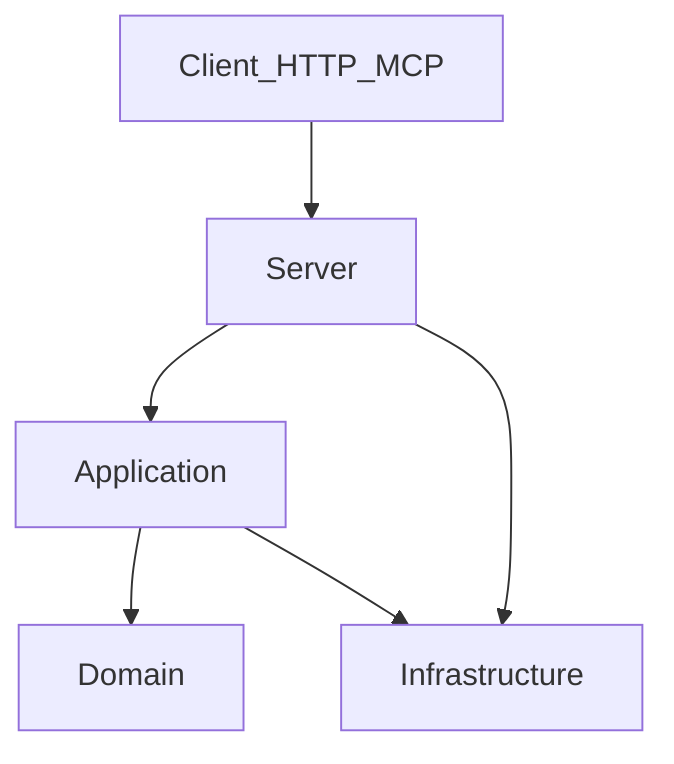

# Proposta de Estrutura e Documentação

**Navegação:** [← Brief (índice)](brief.md) · [README](../README.md)

## Objetivo

Definir uma estrutura de projeto e um conjunto mínimo de documentos para um MCP HTTP focado em insights da Lotofácil, geração determinística de jogos candidatos, análise de estabilidade de indicadores e consumo por agentes de IA.

A proposta parte de uma premissa simples: o ativo principal deste projeto nao e "o servidor", e a semantica das metricas e das estrategias. O papel da arquitetura e proteger essa semantica, tornar o servico operavel e evitar que IA ou humanos confundam insight com previsao.

## Principios de desenho

1. `Semantica antes de framework`: nomes, janelas e significado das metricas precisam ser mais estaveis que a camada HTTP.
2. `Servico stateless`: nada de estado global, cache implicito ou warm-up escondido para responder uma chamada.
3. `Calculo canonico separado de entrega`: a mesma metrica deve poder sair como JSON, ferramenta MCP ou payload para grafico sem recalculo acoplado.
4. `Poucos artefatos, alta utilidade`: cada pasta e cada documento precisa provar por que existe.
5. `Evidencia antes de sofisticacao`: so adicionar camadas, diagramas e processos quando a dor aparecer.
6. `Determinismo e escopo descritivo`: mesmo input => mesmo output; o sistema entrega indicadores e recortes (nao recomendacao de apostas, nem previsao).
7. `Explicabilidade por contrato`: toda analise e todo jogo candidato precisam informar criterios, janela, pesos e estrategia usada.
8. `Servidor sem IA embarcada`: o servidor MCP/HTTP nao orquestra LLM, nao interpreta prompt livre e nao depende de bibliotecas de IA para cumprir o contrato; qualquer cliente inteligente fica fora deste processo.

## Estrutura proposta

```text
lotofacil-mcp/
  README.md
  LotofacilMcp.sln
  Directory.Build.props
  src/
    LotofacilMcp.Domain/
      LotofacilMcp.Domain.csproj
      Models/
      Errors/
      Metrics/
      Strategies/
      Windows/
      Candidates/
      Composition/
      Associations/
      Patterns/
      Normalization/
      Determinism/
      Ports/
    LotofacilMcp.Application/
      LotofacilMcp.Application.csproj
      UseCases/
      Validation/
      Mapping/
    LotofacilMcp.Infrastructure/
      LotofacilMcp.Infrastructure.csproj
      Providers/
      DatasetVersioning/
      CanonicalJson/
      Observability/
    LotofacilMcp.Server/
      LotofacilMcp.Server.csproj
      Program.cs
      appsettings.json
      appsettings.Development.json
      Http/
      Tools/
      DependencyInjection/
      Access/
  tests/
    LotofacilMcp.Domain.Tests/
    LotofacilMcp.Application.Tests/
    LotofacilMcp.ContractTests/
    LotofacilMcp.IntegrationTests/
    LotofacilMcp.E2E.Tests/
    fixtures/
  docs/
    brief.md
    project-guide.md
    metric-catalog.md
    mcp-tool-contract.md
    generation-strategies.md
    prompt-catalog.md
    test-plan.md
    vertical-slice.md
    contract-test-plan.md
    adrs/
      0001-fechamento-semantico-e-determinismo-v1.md
      0002-composicao-analitica-e-filtros-estruturais-v1.md
      0003-processo-desenvolvimento-bmad-vs-spec-driven.md
```

### Diagrama de fronteiras (sem implementacao)




## 1. Essencial

### Casos de uso que a arquitetura deve proteger

1. Analisar os ultimos `N` concursos e retornar indicadores, agregacoes e explicacoes.
2. Identificar quais indicadores tiveram maior estabilidade estatistica em uma janela configuravel.
3. Gerar jogos candidatos a partir de estrategias declaradas, como repeticao/frequencia, slot, distribuicao/entropia e outlier.
4. Explicar por que cada jogo foi gerado, quais filtros foram aplicados e qual o score obtido.

### `src/LotofacilMcp.Server/`

- `Qual problema isso resolve?`
Define a superficie publica do sistema: endpoints HTTP/MCP, binding de request, validacao estrutural, traducao entre contratos externos (request/response) e chamada dos casos de uso.
- `Em que momento do projeto isso se torna necessario?`
Desde o primeiro dia, porque sem essa fronteira o dominio nasce acoplado ao transporte.
- `Quem consome isso?`
Cliente MCP via HTTP, testes de contrato e voce mesmo ao evoluir o contrato.
- `Qual o risco de NAO ter isso?`
Misturar regra de negocio com serializacao, transporte e tratamento de erro; em ASP.NET isso costuma virar handlers/endpoints que acumulam responsabilidade e geram retrabalho quando o contrato muda.
- `Em que cenario isso seria desnecessario ou poderia ser removido?`
Se o projeto deixar de ser um servico e virar apenas uma biblioteca local de analise.

### `src/LotofacilMcp.Domain/`

- `Qual problema isso resolve?`
Centraliza a semantica canonica do dominio: metricas, estrategias, janelas, candidatos, composicao, associacoes, padroes, erros e invariantes.
- `Em que momento do projeto isso se torna necessario?`
Desde o inicio; sem isso a semantica fica espalhada entre endpoints, validacao e camada de entrega.
- `Quem consome isso?`
`Application/`, `tests/`, futuros jobs offline e qualquer adaptador de dados.
- `Qual o risco de NAO ter isso?`
O projeto vira um amontoado de handlers com calculos duplicados e nomes ambiguos; o maior risco e expor metricas inconsistentes para IA.
- `Em que cenario isso seria desnecessario ou poderia ser removido?`
Praticamente nunca, a menos que o projeto seja um experimento descartavel de poucas horas.

**Responsabilidade de normalização canônica (ADR 0001 D20):** o `Domain/` recebe qualquer saída de `Infrastructure/Providers/` como "potencialmente não-normalizada" e aplica, em um único ponto de entrada, as normalizações canônicas — principalmente a ordenação crescente das dezenas do concurso (requisito da definição de `slot` em `metric-catalog.md`). Essa barreira é o que sustenta o anti-padrão #6 (Provider infiltrado no dominio) na prática, não só no texto.

### `src/LotofacilMcp.Application/`

- `Qual problema isso resolve?`
Orquestra casos de uso sem colocar regra estatistica no transporte: resolve janela, chama o dominio, aplica validacoes cross-field, monta respostas explicaveis e coordena metadados operacionais.
- `Em que momento do projeto isso se torna necessario?`
Desde o inicio, porque o contrato MCP ja pede regras de orquestracao que nao pertencem nem ao transporte nem ao calculo puro.
- `Quem consome isso?`
`Server/`, testes de aplicacao e futuros adaptadores nao HTTP.
- `Qual o risco de NAO ter isso?`
O transporte passa a conhecer detalhe demais do dominio, e o dominio passa a receber responsabilidades de fluxo que nao sao matematicas nem semanticas.
- `Em que cenario isso seria desnecessario ou poderia ser removido?`
Se o projeto se reduzisse a uma biblioteca local de calculo puro, sem tools nem contrato externo.

### `src/LotofacilMcp.Infrastructure/`

- `Qual problema isso resolve?`
Isola a origem dos concursos e historicos, a implementacao concreta de `dataset_version`, `canonical_json`, hashing, IO e observabilidade. Tambem evita que o dominio saiba de arquivo, banco, API externa ou formato fisico.
- `Em que momento do projeto isso se torna necessario?`
Assim que houver uma segunda origem de dados, necessidade de teste reproduzivel ou risco de trocar a forma de carga.
- `Quem consome isso?`
`Application/`, `Server/` e testes com fixtures.
- `Qual o risco de NAO ter isso?`
O servico fica preso a uma fonte unica e a semantica das metricas passa a depender de detalhes de infraestrutura.
- `Em que cenario isso seria desnecessario ou poderia ser removido?`
Se todos os dados estiverem embutidos em memoria para um prototipo de curtissima vida util.

### `src/LotofacilMcp.Server/Access/`

- `Qual problema isso resolve?`
Agrupa autenticacao por API Key, throttling, quotas e politicas de acesso sem contaminar a logica de insights.
- `Em que momento do projeto isso se torna necessario?`
Quando a exposicao externa exigir controles operacionais reais. Na V0 e na V1 inicial, essa area pode existir apenas como casca de configuracao, com validacoes desabilitadas por `feature toggle`, mantendo o contrato documentado sem tornar a funcionalidade obrigatoria antes da hora.
- `Quem consome isso?`
`Server/`, operacao do servico e qualquer consumidor que precise entender erros de acesso ou limite.
- `Qual o risco de NAO ter isso?`
Quando esses controles forem ativados, o risco de nao ter essa fronteira e espalhar seguranca pelo transporte. Antes disso, o risco maior e implementar auth/throttling cedo demais e atrasar a validacao da semantica do dominio.
- `Em que cenario isso seria desnecessario ou poderia ser removido?`
Se o servico permanecer sem exposicao externa ou se a politica de acesso continuar explicitamente desligada por configuracao.

### `src/LotofacilMcp.Server/appsettings*.json` (configuracao)

- `Qual problema isso resolve?`
Centraliza configuracoes operacionais: origem dos dados, timeouts, limites de throttling, modo de ambiente e chaves de feature.
- `Em que momento do projeto isso se torna necessario?`
Desde o inicio como ponto unico de configuracao, mas os blocos de API Key e throttling so se tornam obrigatorios quando a exposicao externa entrar no escopo da entrega.
- `Quem consome isso?`
`Server/`, `Infrastructure/` e deploys locais ou remotos.
- `Qual o risco de NAO ter isso?`
Configuracoes se multiplicam em lugares errados, dificultando reproducao, auditoria e mudanca de ambiente.
- `Em que cenario isso seria desnecessario ou poderia ser removido?`
Apenas em prova de conceito inteiramente local e de curtissima duracao.

Notas importantes para .NET:

1. Evite commitar segredos (API keys). Use variaveis de ambiente e, em desenvolvimento, user-secrets.
2. Em .NET, a padronizacao costuma ser via Options Pattern (conceitualmente): valores tipados em vez de ler string solta em varios lugares.

### `src/LotofacilMcp.Server/Program.cs`

- `Qual problema isso resolve?`
Define o ciclo de vida do host HTTP: bootstrap de configuracao, injecao de dependencias e registro das fronteiras (`Server`/`Application`/`Infrastructure`).
- `Em que momento do projeto isso se torna necessario?`
Desde o inicio. O ganho aqui e manter esse arquivo pequeno e “sem semantica”.
- `Quem consome isso?`
O runtime do ASP.NET, desenvolvedor e operacao (rodar local, configurar ambiente).
- `Qual o risco de NAO ter isso?`
Na pratica voce sempre vai ter um entrypoint; o risco real e ele virar o lugar onde tudo mora, o que elimina as fronteiras.
- `Em que cenario isso seria desnecessario ou poderia ser removido?`
Se o projeto deixar de ser um servico HTTP.

### `tests/`

- `Qual problema isso resolve?`
Protege a semantica das metricas, o contrato de acesso e os casos limite que IA tende a explicar bem, mas nem sempre valida bem.
- `Em que momento do projeto isso se torna necessario?`
Desde o inicio, mas com foco cirurgico: testes de metricas canonicas, ordenacao temporal, janelas, determinismo, contrato e explainability minima.
- `Quem consome isso?`
Voce, CI futura e qualquer agente que precise validar regressao.
- `Qual o risco de NAO ter isso?`
O projeto pode parecer coerente em documentacao e respostas de IA, mas derivar valores errados silenciosamente.
- `Em que cenario isso seria desnecessario ou poderia ser removido?`
Em spike descartavel sem compromisso de continuidade. Para projeto pessoal evolutivo, nao vale remover.

### `README.md`

- `Qual problema isso resolve?`
Da o enquadramento correto do sistema: o que ele faz, o que ele nao faz, como subir, quais metricas existem e qual e a tese do projeto.
- `Em que momento do projeto isso se torna necessario?`
Desde o primeiro commit minimamente compartilhavel.
- `Quem consome isso?`
Voce do futuro, colaboradores eventuais e agentes de IA que precisam de contexto confiavel antes de inferir pelo codigo.
- `Qual o risco de NAO ter isso?`
Cada leitura recomeca do zero; o projeto vira refem de contexto oral ou de inferencia por estrutura.
- `Em que cenario isso seria desnecessario ou poderia ser removido?`
Quase nunca. O mais comum nao e remover, e manter enxuto.

### `LotofacilMcp.*.csproj` e `Directory.Build.props`

- `Qual problema isso resolve?`
Declara dependencias, alvo do framework, configuracoes de build e o modo padrao de compilar e executar o servico.
- `Em que momento do projeto isso se torna necessario?`
Desde o inicio, para evitar setup manual implicito e drift entre ambientes.
- `Quem consome isso?`
.NET SDK, ambiente de desenvolvimento, CI futura e qualquer pessoa tentando subir o projeto.
- `Qual o risco de NAO ter isso?`
O projeto vira dependente de conhecimento tacito, comandos avulsos e versoes nao rastreadas.
- `Em que cenario isso seria desnecessario ou poderia ser removido?`
Praticamente nunca em projeto .NET minimamente serio.

### `LotofacilMcp.sln`

- `Qual problema isso resolve?`
Facilita abrir no Visual Studio/Rider, rodar/testar em CI e organizar multiplos projetos quando crescer.
- `Em que momento do projeto isso se torna necessario?`
Desde o inicio se voce quer uma experiencia .NET “padrao”; opcional se voce sempre abre por pasta, mas o custo e baixo.
- `Quem consome isso?`
IDEs, CI e qualquer fluxo que rode solution-level builds/tests.
- `Qual o risco de NAO ter isso?`
Baixo tecnicamente, mas aumenta friccao para evoluir para multiplos projetos e para quem usa Visual Studio.
- `Em que cenario isso seria desnecessario ou poderia ser removido?`
Se o projeto for estritamente um unico projeto e voce optar por manter tudo sem solution (na pratica, raramente vale remover).

### `src/LotofacilMcp.Infrastructure/Observability/` (opcional, mas geralmente barato)

- `Qual problema isso resolve?`
Evita telemetria espalhada e inconsistente. Centraliza padroes de logging, correlacao e convencoes de metrica sem poluir o dominio.
- `Em que momento do projeto isso se torna necessario?`
Assim que existir qualquer necessidade de diagnostico ou quando voce começar a limitar (throttling) e precisar explicar “por que bloqueou”.
- `Quem consome isso?`
Operacao e debugging; `Server/`, `Infrastructure/Providers/` e `Server/Access/` se beneficiam sem duplicar criterio.
- `Qual o risco de NAO ter isso?`
Cada area loga de um jeito; quando der problema, voce coleta muito ruido e pouca informacao acionavel.
- `Em que cenario isso seria desnecessario ou poderia ser removido?`
Em spike local de curtissima duracao sem uso recorrente.

### `docs/metric-catalog.md`

- `Qual problema isso resolve?`
Vira a fonte de verdade semantica das metricas: definicao, formula, janela, unidade, versão, nome alternativo legado e interpretacao correta.
- `Em que momento do projeto isso se torna necessario?`
Assim que existir mais de uma metrica ou qualquer chance de ambiguidade, o que neste dominio acontece muito cedo.
- `Quem consome isso?`
Desenvolvedor, IA consumidora do MCP, testes, documentacao externa e futuras decisoes de produto.
- `Qual o risco de NAO ter isso?`
O sistema passa a usar o mesmo termo para coisas diferentes, como "frequencia" e "atraso", e a IA repete essa ambiguidade para o usuario final.
- `Em que cenario isso seria desnecessario ou poderia ser removido?`
Apenas se houver uma unica metrica trivial, o que nao e o seu caso.

### `docs/adrs/`

- `Qual problema isso resolve?`
Registra decisoes arquiteturais e semanticas de forma versionada e rastreavel: escolha da fonte de dados, semantica canonica de metricas, formato de erro, criterio de throttling, politica de determinismo.
- `Em que momento do projeto isso se torna necessario?`
Neste projeto, ja no inicio — a primeira rodada de fechamento da V1 produziu volume suficiente (ver [ADR 0001](adrs/0001-fechamento-semantico-e-determinismo-v1.md)) para justificar um ADR consolidado em vez de um `decisions.md` solto.
- `Quem consome isso?`
Mantenedor, revisores, IA consumidora que precise justificar comportamento do contrato sem reler todos os documentos.
- `Qual o risco de NAO ter isso?`
O projeto reabre a mesma discussao varias vezes, perde coerencia a cada iteracao com IA e acumula drift silencioso entre catalogo, estrategias e contrato.
- `Em que cenario isso seria desnecessario ou poderia ser removido?`
Se as decisoes pararem de ter impacto estrutural (apenas ajustes taticos).

## 2. Evolutivo

### ADRs adicionais (`docs/adrs/0002+`)

- Conforme surgirem decisoes novas com impacto estrutural (reconciliacao entre providers, novo modelo de cache, mudanca de runtime), criar novos ADRs numerados sequencialmente.
- ADRs antigos nao sao editados em conteudo, apenas recebem status `Superseded` e referencia ao ADR que os substituiu.

### `docs/tool-contracts.md` ou `docs/openapi.yaml`

- `Qual problema isso resolve?`
Formaliza o contrato publico do servico: nomes das ferramentas, argumentos, schemas, erros, limites e exemplos.
- `Em que momento do projeto isso se torna necessario?`
Quando houver mais de um cliente, quando IA passar a depender do servico de forma automatizada, ou quando breaking changes comecarem a doer.
- `Quem consome isso?`
Clientes MCP, consumidores HTTP, testes de contrato e eventualmente geradores de SDK.
- `Qual o risco de NAO ter isso?`
O contrato vira "o que o codigo faz hoje", dificultando compatibilidade e validacao automatica.
- `Em que cenario isso seria desnecessario ou poderia ser removido?`
Se o unico consumidor for voce, de forma manual, e o contrato ainda estiver mudando diariamente.

### Quatro projetos .NET desde o inicio (e nao mais do que isso)

- `Qual problema isso resolve?`
Estabelece fronteiras suficientes para proteger a semantica do dominio, a orquestracao dos casos de uso, a infraestrutura e o host HTTP sem cair em estrutura cenografica.
- `Em que momento do projeto isso se torna necessario?`
Ja no inicio desta implementacao, porque o projeto tem contrato MCP fechado, catalogo de metricas, estrategias de geracao, regras de determinismo e fronteira explicita entre cliente inteligente e servidor stateless.
- `Quem consome isso?`
Mantenedor, CI, testes de contrato e qualquer evolucao futura que reutilize o `Domain` ou o `Application`.
- `Qual o risco de NAO ter isso?`
Misturar host HTTP, transporte MCP, orquestracao de use case e semantica estatistica em um unico assembly, tornando mais facil a infiltracao de infraestrutura no nucleo.
- `Qual o risco de criar cedo demais?`
Ir alem desses quatro projetos e cair em “estrutura cenografica”: assemblies vazios, DI duplicada e navegacao pior sem ganho de clareza.
- `Em que cenario isso seria desnecessario ou poderia ser removido?`
Se o projeto recuasse para uma biblioteca local de calculo sem servidor, sem contrato externo e sem cliente consumindo tools.

Estrutura recomendada:

1. `src/LotofacilMcp.Domain/` (metricas, modelos, invariantes, estrategias, erros, normalizacao)
2. `src/LotofacilMcp.Application/` (casos de uso, validacao cross-field, mapping interno)
3. `src/LotofacilMcp.Infrastructure/` (providers, dataset versioning, canonical JSON, observabilidade)
4. `src/LotofacilMcp.Server/` (host HTTP, tools, DI, feature toggles operacionais)

### `evals/`

- `Qual problema isso resolve?`
Permite validar se o sistema orientado a IA usa as ferramentas certas, interpreta corretamente as metricas e nao produz narrativa enganosa.
- `Em que momento do projeto isso se torna necessario?`
Quando o MCP começar a ser consumido por agentes de forma frequente ou quando respostas erradas tenham custo cognitivo real.
- `Quem consome isso?`
Mantenedor, CI e qualquer workflow de validacao assistida por IA.
- `Qual o risco de NAO ter isso?`
O servico pode continuar "funcionando" tecnicamente, mas degradar na qualidade de uso por IA sem que ninguem perceba.
- `Em que cenario isso seria desnecessario ou poderia ser removido?`
Se o MCP for usado como ferramenta manual e deterministica, sem agente tomando decisoes em cima da saida.

### `fixtures/` ou `tests/fixtures/`

- `Qual problema isso resolve?`
Congela recortes representativos do historico para reproduzir cenarios e regressões sem depender da base viva.
- `Em que momento do projeto isso se torna necessario?`
Quando o historico mudar com frequencia, quando bugs dependerem de recortes especificos ou quando houver CI.
- `Quem consome isso?`
Testes, debugging e eventualmente `evals/`.
- `Qual o risco de NAO ter isso?`
Casos problematicos deixam de ser reproduziveis e a analise vira dependente do estado do dia.
- `Em que cenario isso seria desnecessario ou poderia ser removido?`
Se a base for pequena, estavel e facilmente reconstruivel em cada teste.

### `docs/runbook.md`

- `Qual problema isso resolve?`
Resume operacao real: rotacao de chaves, ajuste de throttling, diagnostico de erro, **failover/alternativas operacionais** de provider (quando existirem) e procedimentos de incidente.
- `Em que momento do projeto isso se torna necessario?`
Quando o servico deixa de ser "rodo localmente quando quero" e passa a ficar disponivel com alguma regularidade.
- `Quem consome isso?`
Voce do futuro e qualquer pessoa que precise operar o servico sem depender de memoria.
- `Qual o risco de NAO ter isso?`
Pequenos incidentes consomem energia desproporcional porque o conhecimento operacional fica todo tacito.
- `Em que cenario isso seria desnecessario ou poderia ser removido?`
Se o projeto nunca for publicado nem operado continuamente.

## 3. Avancado

### `docs/c4/`

- `Qual problema isso resolve?`
Ajuda a comunicar contexto, containers e relacoes quando o sistema ganha multiplos processos, bancos, caches e integracoes.
- `Em que momento do projeto isso se torna necessario?`
Quando a topologia deixar de caber em um paragrafo: mais de um deployable, mais de um provider relevante ou observabilidade separada.
- `Quem consome isso?`
Mantenedores, revisores arquiteturais e onboarding futuro.
- `Qual o risco de NAO ter isso?`
Pouco no inicio; o risco aparece so quando a arquitetura cresce e ninguem mais consegue explicá-la rapidamente.
- `Em que cenario isso seria desnecessario ou poderia ser removido?`
Enquanto a arquitetura couber em uma unica arvore de diretorios comentada. Evite no inicio.

### `notebooks/`

- `Qual problema isso resolve?`
Acelera exploracao de hipoteses, analise de recortes e testes de novas metricas antes de promovê-las ao core.
- `Em que momento do projeto isso se torna necessario?`
Quando voce quiser investigar comportamento antes de consolidar uma nova metrica ou novo provider.
- `Quem consome isso?`
Principalmente o mantenedor.
- `Qual o risco de NAO ter isso?`
Pouco risco estrutural; voce so perde velocidade exploratoria.
- `Em que cenario isso seria desnecessario ou poderia ser removido?`
Se os notebooks virarem fonte de verdade ou codigo morto acumulado. Neste projeto, mantenha-os opcionais.

### `pipelines/` ou jobs assíncronos dedicados

- `Qual problema isso resolve?`
Suporta precomputacao, snapshots, enriquecimento em lote e tarefas pesadas sem bloquear o servico online.
- `Em que momento do projeto isso se torna necessario?`
Quando latencia, volume ou custo de calculo deixarem de ser aceitaveis em tempo de requisicao.
- `Quem consome isso?`
Operacao, observabilidade e fluxos de atualizacao de dados.
- `Qual o risco de NAO ter isso?`
Se introduzido cedo demais, aumenta complexidade sem retorno; se introduzido tarde demais, pode gerar gargalo operacional.
- `Em que cenario isso seria desnecessario ou poderia ser removido?`
Enquanto as metricas puderem ser calculadas on demand com latencia previsivel.

## Documentacao recomendada por tipo

### `README`

Use quando precisar responder rapidamente: o que e, o que nao e, como subir, quais endpoints ou ferramentas existem e qual e a tese do projeto.

Evite transformar em manual completo. Se passar de algumas secoes objetivas, voce esta escondendo documentos mais especificos dentro do lugar errado.

### `Memo curto estilo BMAD`

Use quando existir uma decisao ainda fluida que pede contexto, alternativas e criterio, mas nao justifica ADR formal. Exemplo: "vamos expor atraso por dezena como metrica primaria ou apenas como derivacao?".

Ele e ideal no inicio porque ajuda a pensar e decidir sem inaugurar burocracia. Quando o assunto estabilizar ou virar recorrente, consolide em `decisions.md` ou promova para ADR.

### `ADR`

Use quando a decisao for estrutural, dificil de reverter ou capaz de afetar varias partes do sistema. Exemplo: escolher snapshots versionados versus leitura direta da base ao vivo.

Nao use ADR para registrar detalhe tatico, naming menor ou preferencias de estilo. ADR ruim vira arquivo morto.

### `Catalogo de metricas`

Use desde cedo. Neste projeto ele vale mais que um diagrama bonito, porque o erro mais perigoso nao e topologico; e semantico.

Cada metrica deve declarar pelo menos: definicao, entrada, janela, unidade, dependencias, exemplo e interpretacao incorreta mais comum.

### `docs/mcp-tool-contract.md`

- `Qual problema isso resolve?`
Formaliza as ferramentas MCP, seus argumentos, invariantes, schemas de saida e erros. E o principal artefato para decidir se a automacao por IA sera viavel sem ambiguidades.
- `Em que momento do projeto isso se torna necessario?`
Antes da implementacao de ferramentas reais. Sem isso, a IA vira um consumidor que deduz comportamento pelo nome da funcao.
- `Quem consome isso?`
Agentes de IA, testes de contrato, mantenedor e futuras integracoes HTTP.
- `Qual o risco de NAO ter isso?`
Ferramentas inconsistentes, respostas opacas e alto risco de acoplamento acidental entre prompt e implementacao.
- `Em que cenario isso seria desnecessario ou poderia ser removido?`
Se o projeto nunca expuser MCP e permanecer apenas como biblioteca local.

### `docs/generation-strategies.md`

- `Qual problema isso resolve?`
Separa a definicao das estrategias de geracao da implementacao do motor. Permite declarar pesos, filtros e desempates sem contaminar o catalogo de metricas.
- `Em que momento do projeto isso se torna necessario?`
Assim que existir mais de uma estrategia real de geracao, o que ja e o seu caso.
- `Quem consome isso?`
Motor de geracao, MCP, testes e revisao semantica.
- `Qual o risco de NAO ter isso?`
Os nomes das estrategias passam a esconder regras diferentes ao longo do tempo.
- `Em que cenario isso seria desnecessario ou poderia ser removido?`
Se o projeto abandonar completamente a geracao de jogos candidatos.

### `docs/prompt-catalog.md`

- `Qual problema isso resolve?`
Transforma perguntas reais do dominio em uma suite de prompts rastreavel, cobrindo o que a IA deve conseguir perguntar ao MCP sem ambiguidade.
- `Em que momento do projeto isso se torna necessario?`
Assim que o MCP passar a ser testado ou consumido por agentes de IA de forma recorrente.
- `Quem consome isso?`
Mantenedor, testes E2E, evals e qualquer agente que precise validar cobertura funcional.
- `Qual o risco de NAO ter isso?`
Voce acha que o contrato esta claro, mas nao consegue provar se as perguntas reais do dominio estao de fato cobertas.
- `Em que cenario isso seria desnecessario ou poderia ser removido?`
Se o MCP nunca for consumido por IA e todas as chamadas forem manuais e triviais.

### `docs/test-plan.md`

- `Qual problema isso resolve?`
Fecha a definicao do que significa cobertura total do dominio: metricas, ferramentas, erros, filtros, estrategias e prompts.
- `Em que momento do projeto isso se torna necessario?`
Neste projeto, no momento em que o dominio passa a depender de composicao dinamica, correlacao e filtros estruturais.
- `Quem consome isso?`
Mantenedor, CI futura, testes automatizados e revisoes semanticas.
- `Qual o risco de NAO ter isso?`
A cobertura fica subjetiva; partes importantes do dominio deixam de ser testadas mesmo com documentacao aparentemente madura.
- `Em que cenario isso seria desnecessario ou poderia ser removido?`
Se o projeto for apenas exploratorio e sem compromisso de validacao continuada.

### `Contrato de API ou OpenAPI`

Use quando o contrato deixar de ser informal. Se houver consumidores automatizados, isso passa a ter alto valor.

Nao formalize cedo demais se o servico ainda estiver em exploracao forte; nesse momento um documento curto de contrato costuma bastar.

### `C4`

Use para explicar arquitetura, nao para "provar maturidade". Em projeto pequeno, um unico diagrama de contexto ou container costuma ser suficiente.

Evite suite completa de C4 no inicio. Se nao houver multiplos containers relevantes, o diagrama vira teatro.

## Criterios arquiteturais para tomada de decisao

Antes de adicionar uma nova pasta, documento ou camada, responda:

1. Isso protege semantica, contrato ou operacao?
2. Isso reduz ambiguidade real ou so melhora a aparencia do repositorio?
3. Isso sera consultado em ate 30 dias?
4. Existe um consumidor claro para esse artefato?
5. O custo de mantencao e menor que o custo do mal-entendido que ele evita?

Se a maioria das respostas for "nao", ainda nao e hora de criar.

## Anti-padroes especificos para projeto orientado a IA

### 1. Documentacao cenografica

Criar ADR, C4, roadmap e runbook antes de ter uma decisao real, uma topologia real ou uma operacao real.

`Sinal`: a documentacao parece madura, mas nao ajuda a responder nenhuma pergunta concreta do projeto.

### 2. Estrutura artificial

Separar em muitas camadas/projetos so porque "arquitetura limpa" parece elegante. Em .NET, isso aparece como explosao de `.csproj` (Web/Application/Domain/Infrastructure/Contracts/Abstractions) antes de existir uma dor real. Em projetos pequenos isso produz pastas vazias, DI repetida e navegacao ruim.

`Sinal`: para entender uma metrica simples, voce precisa saltar por 6 arquivos.

### 3. Dependencia da IA sem validacao

Aceitar descricao de metrica, resumo de dados ou sugestao de arquitetura gerada por IA sem teste, exemplo reproduzivel ou revisao semantica.

`Sinal`: a narrativa esta convincente, mas ninguem consegue provar que o numero retornado faz sentido.

### 4. Confundir insight com previsao

O dominio e analise de comportamento e outlier. Quando a arquitetura e a documentacao nao deixam isso explicito, o sistema comeca a induzir leitura preditiva.

`Sinal`: descricoes de ferramenta usam verbos como "prever", "indicar aposta ideal" ou "aumentar chance".

### 5. Contrato guiado pelo front ou pelo grafico

Modelar a semantica da metrica conforme a biblioteca de visualizacao, em vez de modelar o grafico como projecao da metrica.

`Sinal`: o mesmo insight muda de significado porque mudou o payload do cliente.

### 6. Provider infiltrado no dominio

Permitir que detalhes de SQL, scraping, arquivo CSV ou cache definam a regra da metrica.

`Sinal`: trocar a fonte de dados altera o conceito do insight, nao apenas o modo de carregamento.

### 7. Logging sem criterio e observabilidade sem pergunta

Adicionar telemetria e tracing porque "todo sistema moderno precisa", sem saber quais falhas voce quer detectar.

`Sinal`: muito dado operacional e pouca capacidade de decidir algo com ele.

## Recomendacao final

Se eu tivesse que otimizar para aprendizado e velocidade, eu começaria com estes ativos de verdade:

1. `src/LotofacilMcp.Domain/`
2. `src/LotofacilMcp.Application/`
3. `src/LotofacilMcp.Infrastructure/`
4. `src/LotofacilMcp.Server/`
5. `src/LotofacilMcp.Server/appsettings*.json`
6. `src/LotofacilMcp.Server/Program.cs` (minimo)
7. `tests/`
8. `LotofacilMcp.*.csproj`, `LotofacilMcp.sln` e `Directory.Build.props`
9. [brief.md](brief.md)
10. [metric-catalog.md](metric-catalog.md)
11. [mcp-tool-contract.md](mcp-tool-contract.md)
12. [generation-strategies.md](generation-strategies.md)
13. [prompt-catalog.md](prompt-catalog.md)
14. [test-plan.md](test-plan.md)
15. [adrs/0001-fechamento-semantico-e-determinismo-v1.md](adrs/0001-fechamento-semantico-e-determinismo-v1.md)
16. [adrs/0002-composicao-analitica-e-filtros-estruturais-v1.md](adrs/0002-composicao-analitica-e-filtros-estruturais-v1.md)
17. [vertical-slice.md](vertical-slice.md)
18. [contract-test-plan.md](contract-test-plan.md)
19. [adrs/0003-processo-desenvolvimento-bmad-vs-spec-driven.md](adrs/0003-processo-desenvolvimento-bmad-vs-spec-driven.md)

