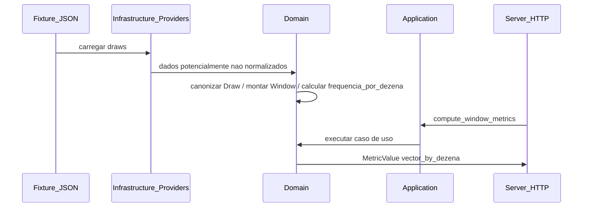

# Fatia vertical mínima (V0)

**Navegação:** [← Brief (índice)](brief.md) · [README](../README.md)

Objetivo: provar **dado bruto → modelo canônico → uma métrica → resposta MCP válida e determinística**, antes de expandir para o catálogo completo.

Referências: [mcp-tool-contract.md](mcp-tool-contract.md), [metric-catalog.md](metric-catalog.md), [project-guide.md](project-guide.md).

**Stack de implementação (V0/V1):** C# / **.NET 10**.

## Escopo da fatia

| Camada | Incluído | Implementação alvo (DDD leve) |
|--------|-----------|-------------------------------|
| Dados | Um único arquivo de histórico fixo (fixture) + leitura determinística | `Infrastructure/Providers/` |
| Normalização | `Draw`: 15 dezenas ordenadas, `contest_id`, `draw_date` conforme contrato | `Domain/Normalization/` + barreira de normalização (ADR 0001 D20) |
| Janela | Recorte por `window_size` e `end_contest_id` | `Domain/Windows/` |
| Métrica | **Somente** `frequencia_por_dezena@1.0.0` | `Domain/Metrics/` |
| Orquestração | Resolução da janela, chamada do domínio e montagem do resultado | `Application/UseCases/` |
| Superfície | **Somente** `get_draw_window` e `compute_window_metrics` por HTTP | `Server/Tools/` |

## Fluxo ponta a ponta

## Fora da V0 (próximas fatias)

- A V0 é uma fatia isolada e fixture-controlada, feita para validar semântica e determinismo antes da primeira exposição externa completa.
- Demais métricas, tools (`analyze_*`, `generate_*`, `explain_*`), composição, associações, geração.
- Autenticação, throttling e quotas (permanecem fora da V0 e podem continuar desabilitados por `feature toggle` na V1 inicial).
- Persistência e fontes diferentes do arquivo fixture.

## Critérios de aceite (obrigatórios)

1. **Contrato**: resposta de `compute_window_metrics` com um único request `{ "name": "frequencia_por_dezena" }` inclui `MetricValue` com `metric_name`, `scope = window`, `shape = vector_by_dezena`, `unit = count`, `version = 1.0.0`, `window` explícito, `value` como vetor de 25 inteiros não negativos, `explanation` preenchida.
2. **Consistência**: soma dos 25 contadores = `15 × window_size` (cada sorteio contribui 15 dezenas).
3. **Determinismo**: duas chamadas com o mesmo `dataset_version`, mesma fixture e mesmos parâmetros produzem o mesmo `deterministic_hash` (definição no contrato, invariante 7).
4. **Ordenação**: `get_draw_window` devolve concursos em ordem crescente de `contest_id`.
5. **Negativo**: métrica inexistente retorna erro `UNKNOWN_METRIC` com shape de erro do contrato.

## Critérios de aceite (recomendados na mesma PR)

- Teste automatizado de fórmula (valores esperados à mão) para a janela sintética mínima definida em [contract-test-plan.md](contract-test-plan.md).
- Teste de contrato que valida o JSON de resposta contra os campos obrigatórios listados em (1).

## Definição de “pronto” para encerrar a V0

A fatia está fechada quando os critérios obrigatórios estão cobertos por testes na CI e a documentação deste arquivo permanece alinhada ao comportamento observado nos testes.
